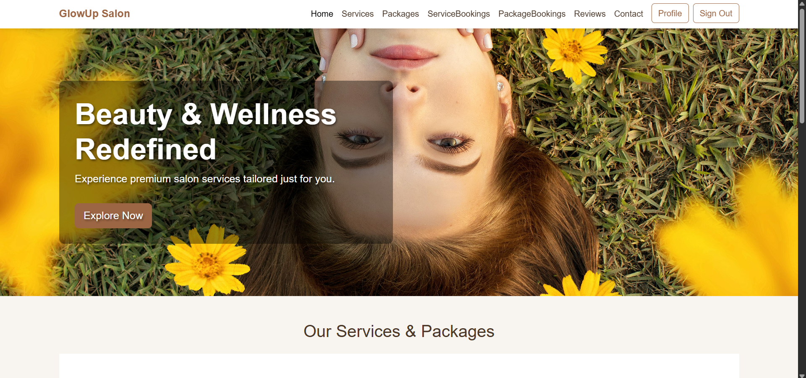
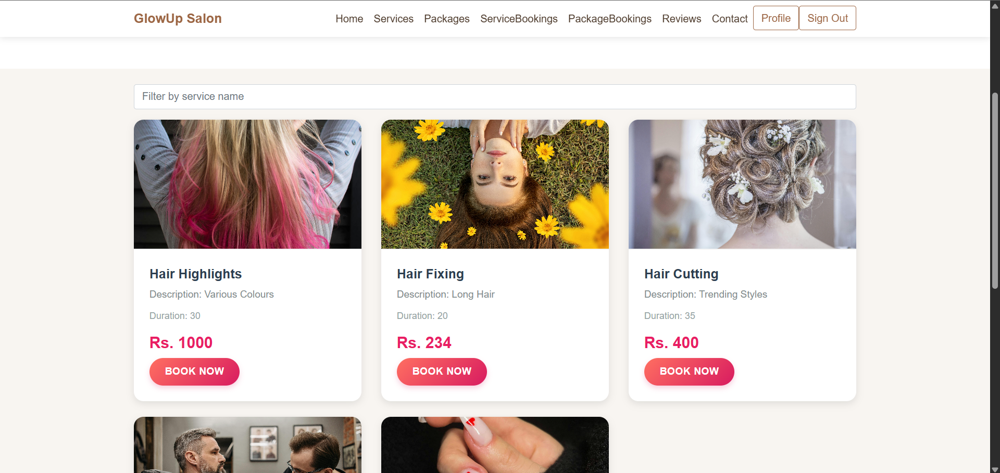
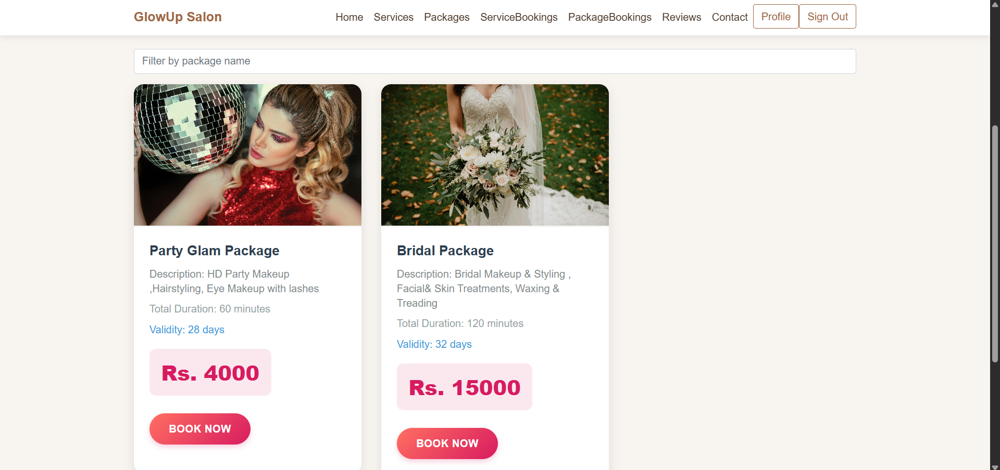
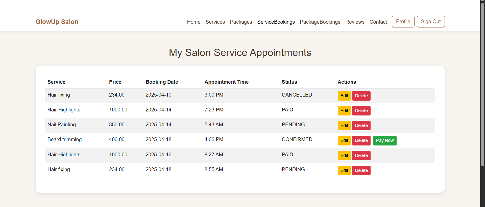
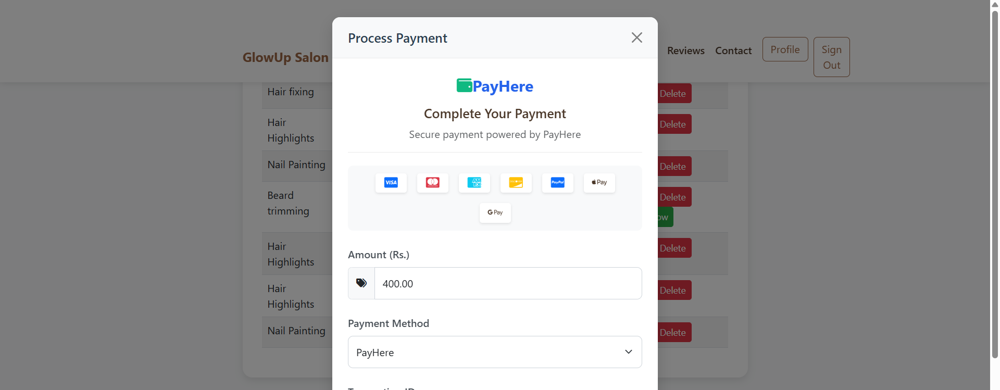
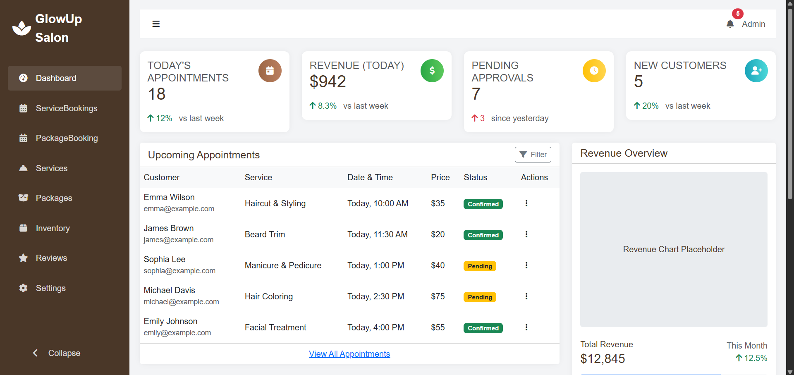
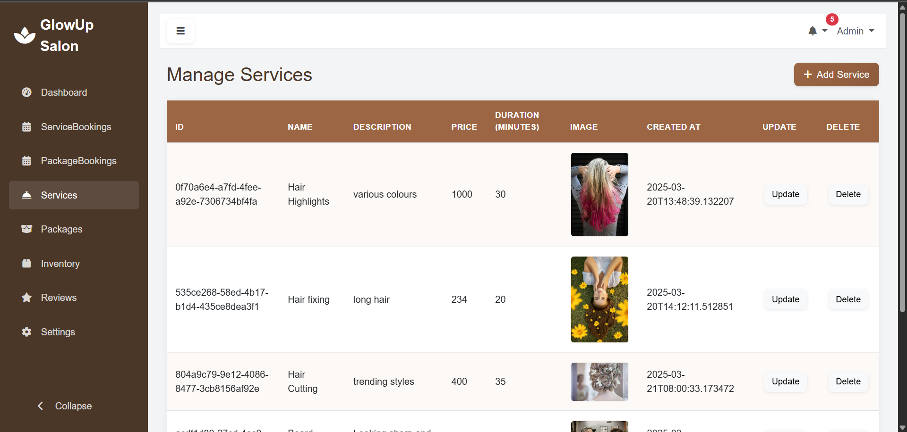
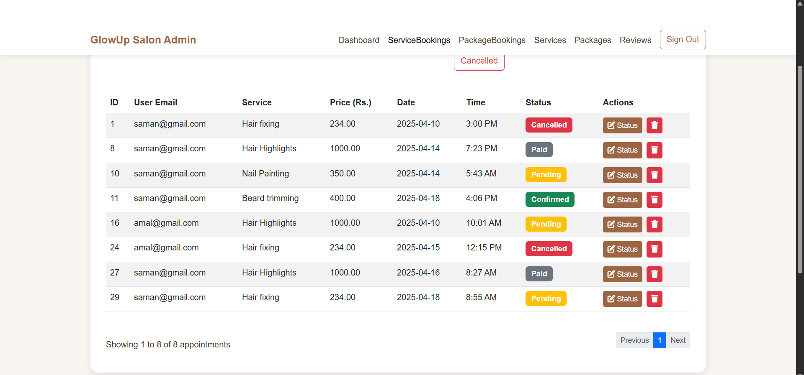

# GlowUp Salon Appointment System

## Project Description

GlowUp Salon Appointment System is a full-stack web application designed to streamline salon operations and enhance the customer experience. The system comprises two primary modules:

- **Customers**: Allows users to browse services, book appointments, make payments, and provide feedback.
- **Admins**: Enables salon administrators to manage services, appointments, inventory, and customer profiles.

## Features

### For Customers

- **Browse and Select Services and Packages**: Explore a variety of salon services, such as haircuts, styling, manicures, and more.
- **Book Appointments**: Choose from available time slots and book appointments based on preferences.
- **Appointment Approval**: Await approval from the admin before the appointment is confirmed.
- **Payment Process**: Make secure payments through an integrated payment gateway after admin approval.
- **View Booking Details**: Check the status of bookings, including approval and payment status.
- **Leave Ratings and Reviews**: Rate the service and leave reviews based on the experience.

### For Admins

- **Manage Services**: Add, update, or remove available services to keep offerings up-to-date.
- **Approve or Modify Appointments**: Approve, reject, or modify customer appointments based on availability.
- **Customer Profiles**: Access customer's booking and payment history to understand preferences and trends.
- **Manage Inventory**: Track inventory such as shampoos, hair dyes, and other products to ensure efficient stock management.

## Key Features Images

### Customer Dashboard


### Salon Services Page


### Salon Packages Page


### Customer’s Service Appointments Page


### Payment Gateway


### Admin Dashboard


### Add Services Page


### All Appointments Page


## Video Demonstration
Watch the video demonstration of the application here: [YouTube Link](https://youtu.be/uczaOAsKdk4?si=3ATlOPjPkqFqOQMV)

## Installation Instructions

### Clone the repository:

```bash
git clone https://github.com/kavindisathsarani/GlowUp-Salon.git
```

Import the project into your preferred IDE (e.g., IntelliJ IDEA, Eclipse).

---

### Configure the Database:

- Update database connection settings in the `application.properties` file located in `src/main/resources/`:

```properties
spring.datasource.url=jdbc:mysql://localhost:3306/glowup_salon
spring.datasource.username=your_db_username
spring.datasource.password=your_db_password
```

---

### Run the Application:

- Build and run the Spring Boot application using Maven:

```bash
mvn clean install
mvn spring-boot:run
```


### Access the Frontend:

- Open the `login.html` file from the frontend folder in your web browser.
- If using AJAX, ensure your requests are pointed to the correct backend endpoint (e.g., `http://localhost:8080/api/...`).

## Authentication

- The application uses **JWT (JSON Web Token)** for secure user authentication.
- Upon successful login, the server issues a JWT token, which must be included in the headers of protected API requests.
- Example header format:

```
Authorization: Bearer <your_jwt_token>
```

---

## Technologies Used

- **Frontend**: HTML, CSS, Bootstrap, JavaScript, AJAX
- **Backend**: Spring Boot, Spring Security (JWT), Spring Data JPA
- **Database**: MySQL
- **Authentication**: JWT (JSON Web Token)

---

## Author
Developed by **Kavindi Sathsarani**.

